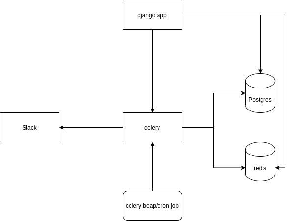

#Architecture|

the basic architecture of the app, a django app that need a postgres and redis,
will depend on from a celery that will be used to run the tasks to be in charge than 
send the notifications to the users for the lunch in the office.

the database will be a postgres

the broker for celery will be redis

celery will be used to run the tasks asynchronously
celery beat will start the scheduler to run the tasks (so the user don't need to send manually the lunch list)

