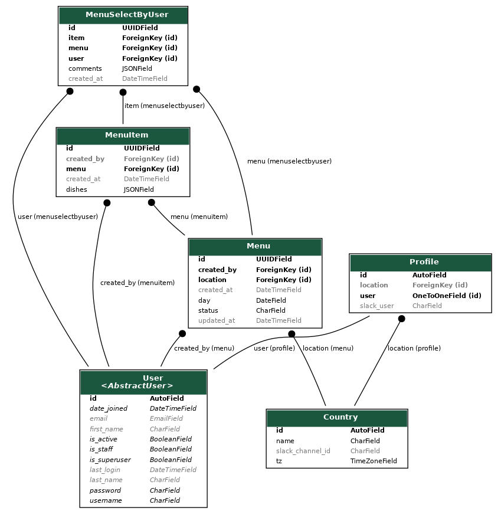

#Data

the project for send the menu for day compose of 3 apps

## Menu

this module is for create, edit and user can select the menu of the day

### models

#### Menu
| Fields   |      type      |  comments |
|----------|:-------------:|------:|
| day |  date | day for the menu |
| status |    str   | control if the menu was already send by celery |
| location |    fk   | location office for the menu |
| created_at | datetime | datetime when the menu was created |
| updated_at | datetime | datetime when the menu was updated |
| created_by | fk | user than create the menu |

Note: a menu for a specific date and  location, can only be created once

#### MenuItem
| Fields   |      type      |  comments |
|----------|:-------------:|------:|
| menu |  fk | ForeignKey to the menu |
| dishes | json | contains the dishes that compose the menu item |
| location |    fk   | location office for the menu |
| created_at | datetime | datetime when the menu was created |
| created_by | fk | user than create the menu |

#### MenuSelectByUser
| Fields   |      type      |  comments |
|----------|:-------------:|------:|
| menu |  fk | ForeignKey to the menu |
| user | fk | user than select his/her dishes |
| item |  fk | ForeignKey to the menu item |
| comments | json | comments for dishes |
| created_at | datetime | datetime when the menu was created |

## Location

this module is for create, edit and countries, this module allow to
create new location so we can send more menu to the users

### models

#### Country
| Fields   |      type      |  comments |
|----------|:-------------:|------:|
| name | str | name for the office |
| tz |    str   | timezone for location |
| slack_channel_id |    str   | channels slack to send menu messages |

## ProfileUser

this module is for create, edit and countries

### models

#### Country
| Fields   |      type      |  comments |
|----------|:-------------:|------:|
| user | fk | User related to profile |
| location |    fk   | location for the user |
| slack_user |    str   | channels slack to send menu messages |

## DB representation

